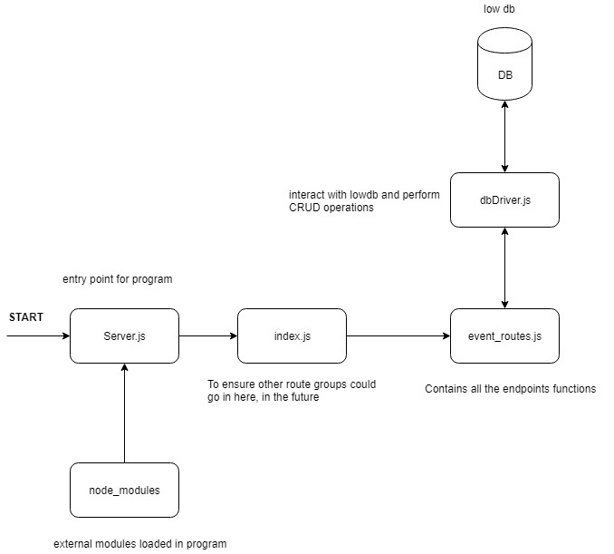

# EventFinder

Following application is developed using node.js and lowdb.

## Dependencies required

Following packages required to run this code:

1. [node.js](https://nodejs.org/en/)
2. [postman](https://www.getpostman.com/downloads/)

## Usage

clone the code from git

```text
git clone https://github.com/codingisbliss/EventFinder.git
```

Or if you don't have git installed in your system use [this](https://git-scm.com/book/en/v2/Getting-Started-Installing-Git) or download zip from [here](older version)(https://drive.google.com/open?id=1Yg92t8AQO-3uXkthk_hXdsXGPQP5-muY).

Start node server inside EventFinder directory

```text
node server.js
```

go to postman

* [http://localhost:8000/register](http://localhost:8000/register) select "POST"

In Body select -&gt; \(x-www-form-urlencoded\) and type following keys:

<table>
  <thead>
    <tr>
      <th style="text-align:left">Key name</th>
      <th style="text-align:left">description</th>
    </tr>
  </thead>
  <tbody>
    <tr>
      <td style="text-align:left">email</td>
      <td style="text-align:left">Enter email Id you want to register with</td>
    </tr>
    <tr>
      <td style="text-align:left">passwd</td>
      <td style="text-align:left">Enter your password</td>
    </tr>
    <tr>
      <td style="text-align:left">collectionName</td>
      <td style="text-align:left">
        <p>Enter any one of following (<b>Music</b> for now):</p>
        <p>&quot;Arts &amp; Theater&quot;, &quot;Film&quot;, &quot;Miscellaneous&quot;,
          &quot;Music&quot;, &quot;Sports&quot;, &quot;Undefined&quot;,&quot;Donation&quot;,
          &quot;Event Style&quot;, &quot;Group&quot;, &quot;Individual&quot;, &quot;Merchandise&quot;,
          &quot;Nonticket&quot;, &quot;Parking&quot;, &quot;Transportation&quot;,
          &quot;Upsell&quot;, &quot;Venue Based&quot;]</p>
      </td>
    </tr>
    <tr>
      <td style="text-align:left">genre</td>
      <td style="text-align:left">
        <p>Enter any one of following:</p>
        <p>&quot;R&amp;B&quot;, &quot;Hip-Hop&quot;,&quot;Rap&quot;,&quot;Comedy&quot;,&quot;Classical&quot;,&quot;Jazz&quot;,&quot;Foreign&quot;,&quot;Dance&quot;,&quot;Electronic&quot;
          ,&quot;Comedy &quot;</p>
      </td>
    </tr>
  </tbody>
</table>* [http://localhost:8000/login](http://localhost:8000/login) select "GET" 

In Body select -&gt; \(x-www-form-urlencoded\) and type following keys:

| Key Name | description |
| :--- | :--- |
| email | your email email Id which was registered |
| passwd | password for email Id used. |

* [http://localhost:8000/getEvents](http://localhost:8000/getEvents) select "GET"

You need to use /login before accessing this endpoint else it will respond with "no Authorization" message.

Output is given in console with error if any.

* [http://localhost:8000//setPreferences](http://localhost:8000//setPreferences) select "POST" 

In Body select -&gt; \(x-www-form-urlencoded\) and use following keys:

| Key Name | description |
| :--- | :--- |
| collectionName | enter the collection you want to update your preference |
| genre | Enter new genre |

## Why Node.js?   <a id="why-node-js"></a>

Apart from Node I had option of using Django and PHP, so I selected this Framework because:‌

1. Its asynchronous and stateless platform that can handle multiple request easily with better performance and reliability.
2. A better community support.
3. Wanted to learn new language and enhance my skills.

## Why low db?   <a id="why-low-db"></a>

I favored this type of database because :‌

1. It has high promise for CRUD operation on Database. 
2. Better than SQLite because our app doesn't require lot on transnational requests.
3. Equally good with Couchbase, and less complex than MongoDB .

## Implementation details



## Database Design

```text
{
    profile :[
    {
        "pid" : unique String
        "email":string
        "password": encrypted String
        "classificationName":String
        "genreID" : String
    }
    ],
    //loaded as default in database
    "classification": {
    "Music": {
      "R&B": "KnvZfZ7vAee",
      "Hip-Hop": "KnvZfZ7vAv1",
      "Rap": "KnvZfZ7vAv1",
      "Comedy": "KnvZfZ7vAe1",
      "Classical": "KnvZfZ7v7nJ",
      "Jazz": "KnvZfZ7vAvE",
      "Foreign": "KnvZfZ7vAk1",
      "Dance": "KnvZfZ7vAvF",
      "Electronic": "KnvZfZ7vAvF"
    },
    "Film": {
      "Horror": "FnvZfZ7vAee",
      "Action": "FnvZfZ7vAv1",
      "Romance": "FnvZfZ7vAv1"
    }
  }
}
```

## TODO

1. In database, create separate document for User Account information like email and password and User Profile information like collectionName, genre to improve security.
2. I have passed email Id in session cookie which not secured. "pid"  could be used instead, however it add more request to server.
3. ~~print output in postman from /getEvent instead of console.~~
4. email Id regex checker to check argument received from front end


